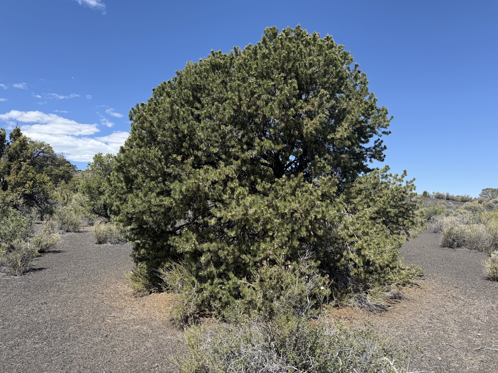
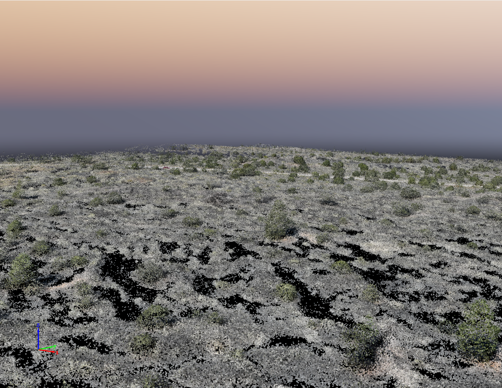
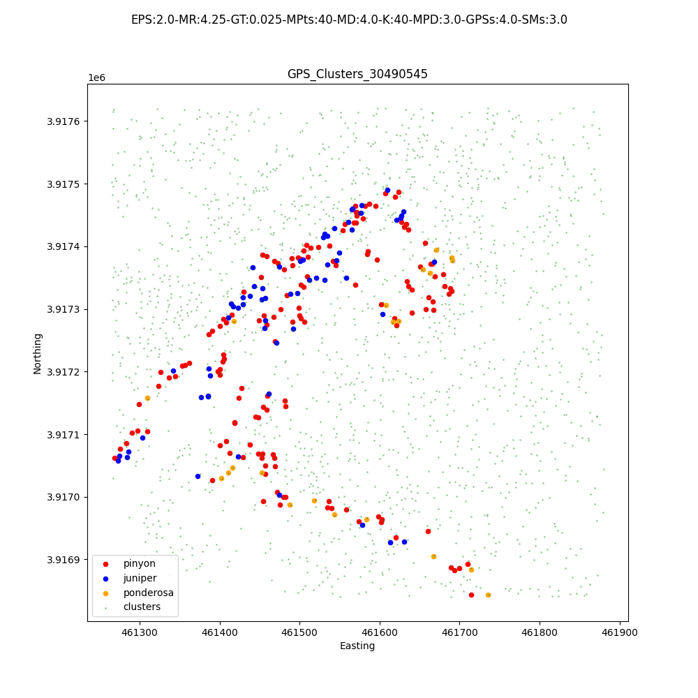
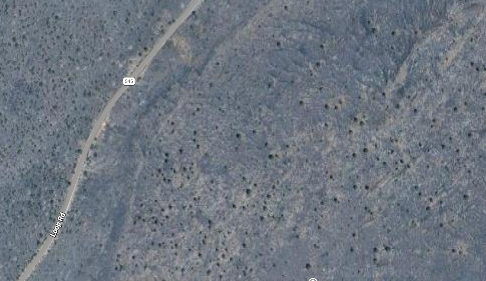

# Pinyon-Detection

A research project intended to identify drought-tolerant pinyon pines from drone-collected SFM pointclouds processed using PixMapper4D. Currently, data has only been collected from a field site at **Sunset Crater, AZ**. The processing is done on the **Monsoon** SLURM HPC cluster at Northern Arizona University. 

<div align="center">
  
</div>
A drought susceptable pinyon pine at site A in Sunset Crater, AZ.

The pipeline takes in raw `.las` files, builds a Canopy Height Model, detects
tree tops as CHM peaks, segments individual crowns via watershed, matches
GPS-tagged ground-truth species to clusters, and trains a species classifier
on the labeled subset. All `.las` used have been exported from PixMapper4D.

<div align="center">
  
</div>
Screenshot of Structure-from-motion pointcloud of site A in Sunset Crater, AZ. Visualized using PixMapper4D.

The project is split into two independent stages:

- **`clustering/`** — everything expensive: point cloud processing, CHM,
  watershed segmentation, GPS label matching. Run via `run_clustering.py`,
  usually swept over many parameter combinations to optimize the matching
  score. Depending on parameters, can take anywhere from 25 minutes to an hour. 
  See [`clustering/README.md`](clustering/README.md).

- **`modelling/`** — species classification on the labeled clusters
  `clustering/` produced. Run via `train_model.py`, fast enough to iterate
  on interactively. Currently only trained on species, not drough tolerance.
  Takes a lot less time to run, usually less than 5 minutes. See [`modelling/README.md`](modelling/README.md).

These used to be one script (`main.py`). They were split apart because clustering was taking too long and was not required for training the model. The main file became too cluttered, and was clearly two seperate parts. 

---

## Repository Structure
(May not be completely up-to-date)
```
Pinyon-Detection/
├── README.md                 # this file
├── PIPELINE.md                # detailed stage-by-stage walkthrough
├── .gitignore                 # excludes generated point clouds, clusters, logs, venv
│
├── clustering/
│   ├── run_clustering.py      # entry point — clustering + GPS labeling
│   ├── constants.py           # STEPS flags, get_paths(trial_name)
│   ├── functions/              # io, preprocessing, detection, labeling
│   ├── shells/                 # pinyons.sh, pinyon_sweep.sh, Drive sync scripts
│   └── parameters/             # params.txt sweep grids
│
├── modelling/
│   ├── train_model.py         # entry point — classifier training
│   └── functions/              # features, classification
│
├── shells/                    # cross-cutting utilities
│   ├── train_model.sh
│   ├── setup_venv.sh
│   ├── debug.sh
│   ├── see_recent_jobs.sh
│   └── clear_garbage_files.sh
│
├── trial_data/
│   └── Sunset_sfm_trial/
│       ├── data/point_cloud/    # raw .las input files
│       ├── pointclouds/         # saved raw and cleaned .ply files
│       ├── CFMs/                # Canopy Height Model GeoTIFFs
│       ├── clusters/            # segmented tree clusters (.ply)
│       ├── labeled_clusters/    # clusters with GPS species labels
│       ├── multi_match_clusters/# clusters behind ambiguous GPS matches
│       ├── labels/              # GPS label CSVs
│       ├── dataframes/          # cached df_clusters / df_deep_clusters
│       ├── images/              # diagnostic plots
│       └── results/             # sweep result CSVs
│
└── results/                   # legacy aggregate CSVs from early manual trials
```

---

## Quick Start

### 1. Environment setup

```bash
bash shells/setup_venv.sh
source open3d_env/bin/activate
```

Requires Python 3.10. Key dependencies: `open3d`, `numpy`, `scipy`,
`scikit-learn`, `rasterio`, `scikit-image`, `laspy`, `pyproj`, `pandas`,
`matplotlib`, `xgboost`. 

`.gitignore` excludes `open3d_env/` and every generated pipeline artifact
(point clouds, clusters, CHMs, dataframes, images, SLURM logs) — these are
all regenerable from a `run_clustering.py` run and get large fast and are mainly used for debugging, so they
stay out of git history. `results/` CSVs are small and are the actual
experiment record, so those stay tracked.

### 2. Configure paths and steps

Edit `clustering/constants.py`:
- `get_paths(trial_name)` — all input/output paths, derived from the trial name
  - `PATHS["DATA"]` needs to have the .las files to run, at least for the first time.
  - `PATHS[DSM]` can have a DSM if one is available, if not it can get created. 
- `STEPS` — boolean flags controlling which clustering stages re-run
  - Steps can only be skipped after being ran at least once, so the data can be saved.

### 3. Run clustering + labeling

```bash
sbatch clustering/shells/pinyons.sh
```

See [`clustering/README.md`](clustering/README.md) for CLI args, the
`params.txt` sweep format, and current known quirks.

### 4. Train the classifier

```bash
sbatch shells/train_model.sh
```

See [`modelling/README.md`](modelling/README.md) for the enhancement
toggles, the `--advanced` classifier comparison, and semi-supervised label
spreading.

---

## Matching Score

`clustering/`'s output metric: the fraction of GPS-labeled trees with
exactly one detected cluster within `max_distance`.

<div align="center">
  
</div>
Graph displaying clusters and labels collected from the field of site A in Sunset Crater, AZ.

```
Perfect matches (1:1):   197  (83.5%)
No match:                26  (11.0%)
Multiple clusters:       13  (5.5%)
Matching score:          0.835
```

Best achieved on Sunset Crater so far: **~0.835**.

---

## The Data Bottleneck

The labeled dataset is small — **~236 labeled clusters**, with **ponderosa
at only ~20 samples**. This has been the fundamental constraint on
classifier performance; no model architecture, oversampling, weighting, or
feature engineering approach tried so far has overcome it. More labeled
ground-truth data, not a better classifier, is the highest-leverage next
step for the modelling side.

---

## Field Site

**Sunset Crater**, Arizona. The scan area covers a cinder cone with
significant terrain variation (~30 m relief). The irregular drone flight
path means coverage is not a uniform rectangle — a `coverage_radius`
proximity filter in the label matcher handles the non-rectangular footprint.

Species present: pinyon pine, juniper, ponderosa pine.

<div align="center">
  
</div>
Aerial screen shot of site A in Sunset Crater, AZ. Taken on Google Maps.

---

## See Also

- [`PIPELINE.md`](PIPELINE.md) — detailed walkthrough of every pipeline stage
- [`clustering/README.md`](clustering/README.md) — clustering/labeling details, params.txt format, known quirks
- [`modelling/README.md`](modelling/README.md) — classifier details, enhancement toggles, known quirks